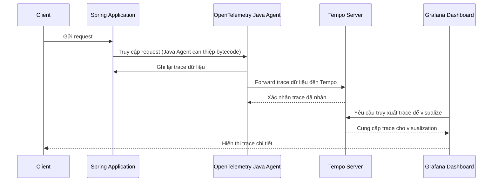
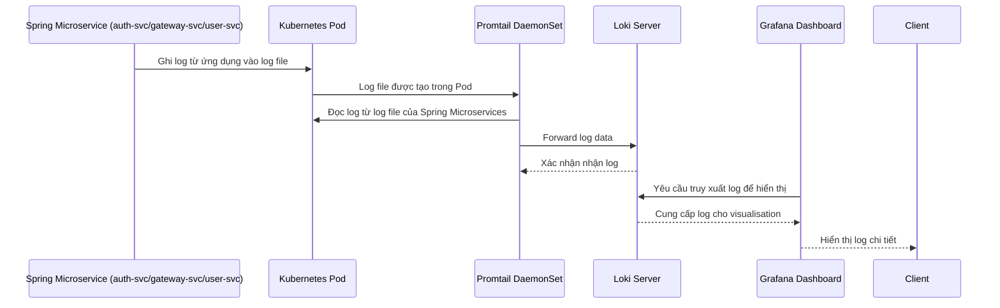
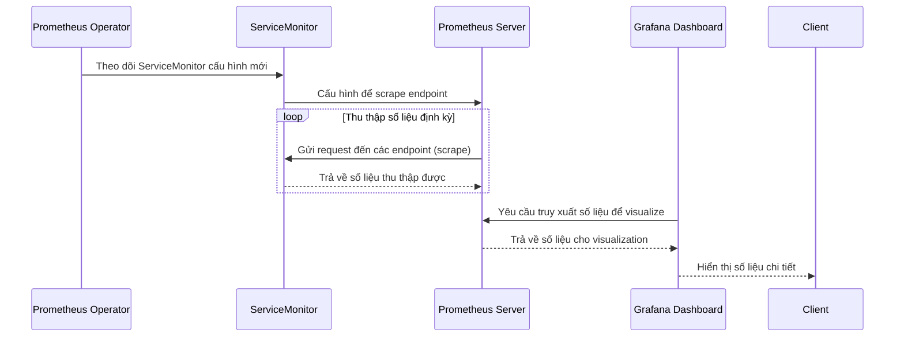
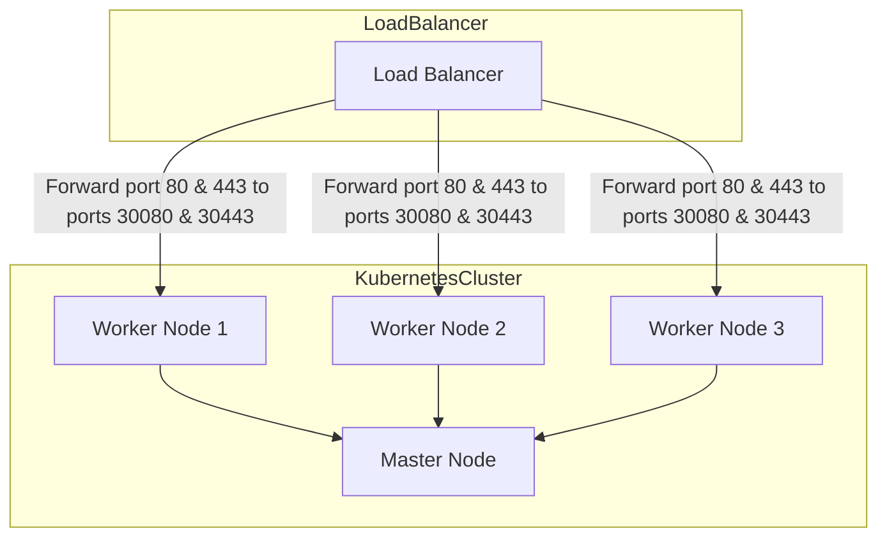

## Tracing Request

```mermaid
sequenceDiagram
  participant Client as Client
participant SpringApp as Spring Application
participant OtelAgent as OpenTelemetry Java Agent
participant Tempo as Tempo Server
participant Grafana as Grafana Dashboard

Client->>SpringApp: Gửi request
SpringApp->>OtelAgent: Truy cập request (Java Agent can thiệp bytecode)
OtelAgent->>SpringApp: Ghi lại trace dữ liệu
OtelAgent->>Tempo: Forward trace dữ liệu đến Tempo
Tempo-->>OtelAgent: Xác nhận trace đã nhận
Grafana->>Tempo: Yêu cầu truy xuất trace để visualize
Tempo-->>Grafana: Cung cấp trace cho visualization
Grafana-->>Client: Hiển thị trace chi tiết
```
# Logging aggregation

```mermaid
sequenceDiagram
  participant SpringService as Spring Microservice (auth-svc/gateway-svc/user-svc)
  participant Pod as Kubernetes Pod
  participant Promtail as Promtail DaemonSet
  participant Loki as Loki Server
  participant Grafana as Grafana Dashboard

  SpringService->>Pod: Ghi log từ ứng dụng vào log file
  Pod->>Promtail: Log file được tạo trong Pod
  Promtail->>Pod: Đọc log từ log file của Spring Microservices
  Promtail->>Loki: Forward log data
  Loki-->>Promtail: Xác nhận nhận log
  Grafana->>Loki: Yêu cầu truy xuất log để hiển thị
  Loki-->>Grafana: Cung cấp log cho visualisation
  Grafana-->>Client: Hiển thị log chi tiết
```
# Prometheus Collect metrics

```mermaid
sequenceDiagram
  participant PrometheusOperator as Prometheus Operator
  participant ServiceMonitor as ServiceMonitor
  participant Prometheus as Prometheus Server
  participant Grafana as Grafana Dashboard

  PrometheusOperator->>ServiceMonitor: Theo dõi ServiceMonitor cấu hình mới
  ServiceMonitor->>Prometheus: Cấu hình để scrape endpoint
  loop Thu thập số liệu định kỳ
    Prometheus->>ServiceMonitor: Gửi request đến các endpoint (scrape)
    ServiceMonitor-->>Prometheus: Trả về số liệu thu thập được
  end
  Grafana->>Prometheus: Yêu cầu truy xuất số liệu để visualize
  Prometheus-->>Grafana: Trả về số liệu cho visualization
  Grafana-->>Client: Hiển thị số liệu chi tiết

```

# Deploy

```mermaid
flowchart TB
    subgraph LoadBalancer
        LB[Load Balancer]
    end

    LB -- "Forward port 80 & 443 to ports 30080 & 30443" --> Worker1[Worker Node 1]
    LB -- "Forward port 80 & 443 to ports 30080 & 30443" --> Worker2[Worker Node 2]
    LB -- "Forward port 80 & 443 to ports 30080 & 30443" --> Worker3[Worker Node 3]

    subgraph KubernetesCluster
        direction TB
        Worker1
        Worker2
        Worker3
        MasterNode[Master Node]
    end

    Worker1 --> MasterNode
    Worker2 --> MasterNode
    Worker3 --> MasterNode

```
