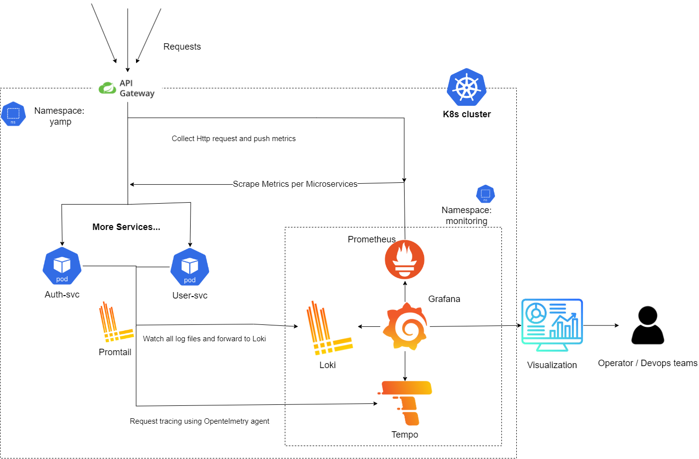
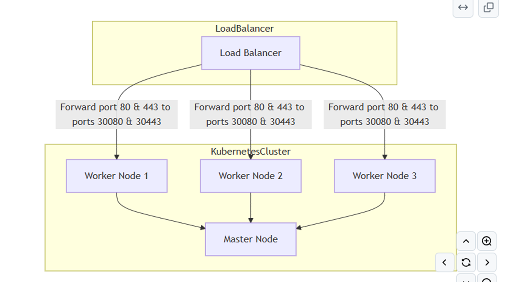

# Monitoring System for Microservices on Kubernetes

This repository contains the implementation of a monitoring system for microservices running on a Kubernetes cluster. The project integrates various tools and practices for infrastructure management, application deployment, and system monitoring.

## Project Overview

- **Objective**: Build a monitoring and tracing system for microservices running on a Kubernetes cluster with 4 nodes (1 master and 3 worker nodes).
- **Scope**:
  - Monitor performance metrics of Kubernetes and microservices.
  - Centralize logging and enable tracing for quick troubleshooting.
  - Deploy a scalable and resilient monitoring stack.

## Key Features

- **Infrastructure as Code**:
  - Utilized **Terraform** to provision infrastructure on **Google Cloud Platform (GCP)**.
  - Configured network, firewalls, and Load Balancer for the Kubernetes cluster.

- **Kubernetes Cluster**:
  - Set up a Kubernetes cluster from scratch using **Ansible**.
  - Deployed microservices (e.g., `auth-svc`, `gateway-svc`, `user-svc`) as Helm charts.

- **Monitoring Stack**:
  - Tools used: **Prometheus**, **Grafana**, **Tempo**, **Loki**, and **Promtail**.
  - Configured:
    - Prometheus for collecting metrics.
    - Grafana for visualization dashboards.
    - Loki for centralized logging.
    - Tempo for tracing.
  - Integrated with **OpenTelemetry Java Agent** for tracing in Spring applications.

- **Visualization and Alerts**:
  - Built Grafana dashboards for real-time monitoring.
  - Set up alerts to notify the team about critical issues.

## System Architecture

## Kubernetes Deployment

### Tools and Technologies

- **Languages**: Java (Spring Framework), YAML (Helm charts)
- **DevOps Tools**: Terraform, Ansible, Helm
- **Monitoring Tools**: Prometheus, Grafana, Loki, Tempo, Promtail
- **Cloud Provider**: Google Cloud Platform

## Challenges and Achievements

- Overcame the complexity of setting up a custom Kubernetes cluster without using managed services like GKE.
- Learned to integrate and optimize monitoring tools for a production-like environment.

## Resources

- [Monitoring Stack Setup Demo](https://www.youtube.com/watch?v=ZQFAPg_Vxxw)
- [Project Report](./docs/NT531%20-%20report.pdf)

---

Feel free to explore the repository and provide feedback!
